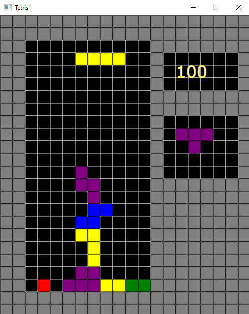

# TETRIS
> The Tetris game.

## Table of contents
* [General info](#general-info)
* [Screenshots](#screenshots)
* [Technologies](#technologies)
* [Features](#features)
* [Status](#status)
* [Inspiration](#inspiration)
* [Contact](#contact)

## General info
The purpose of the project is to show how I managed to do a complete Project.

## Screenshot

## Technologies
* Java 13 - version 13.0.1
* JavaFX - version 13.0.2

## Features
* Awesome 8-bit music playing in the Background
* Ability to save Scores and Load them locally

## Status
Project is: _finished_

## Inspiration
Based on popular Game Tetris made by Aleksiej Pażytnow.

## Contact
Created by MrJinno. Email: wojtczakbartek7@gmail.com